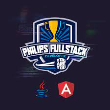

  
   
   

# Presentation
This repository is part of the bootcamp ["Philips Fullstack Developer | You Are You"](https://web.dio.me/home). In this project it was developed a basic front end using Angular framework. You are invited to use the codes and improve them. It will be great if you have comments or suggestions to make them better. 

## Tecnologies And Tools
GIT - HTML - CSS3 - BOOTSTRAP - FLEXBOX - JAVA SCRIPT - ANGULAR - VS Code

## Usage
We assume that Angular Framework is already installed in your system:
- Open a terminal to execute the following cli commands.
- Create a new Angular projec:
  `ng new bookstoreFront`
- Install the project dependencies:
  `npm install`
- Install Bootstrap:
  `npm i bootstrap` 
- Download or clone the content of this repository and move the following folders and files into your project folder.
  - ./package.json
  - ./angular.json
  - ./src/*
   